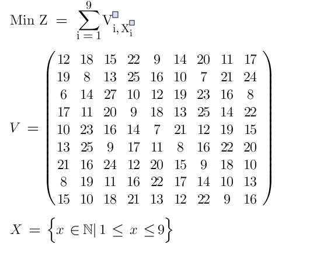

O seguinte trabalho implementa a lista Tabu para o seguinte problema

A solução é dada por gerar uma solução aleatória para o problema colocando em um array a solução sem repetir os valores, após isso roda em loop cada iteração do programa até que se alcance 50 iterações sem nenhuma melhoria.

Em cada iteração acontece o seguinte caso:
- Aumenta a iteração
- Gera os vizinhos. Os vizinhos são gerados por meio de escolher dois números aleatórios distintos entre 1 e 9, a posição referente a cada valor dentro do array de solução é trocada, a troca é feito para garantir que o array continue oferecendo números distintos em cada casa
- Ordena os vizinhos por função objetivo do menor ao maior
- Compara cada vizinho até achar as mudanças feitas nos indices não estejam na lista tabu ou que a função objetivo seja menor
  - Atualiza a solução atual
  - Caso a função objetivo seja menor, atualiza a melhor solução

As constantes definidas foram:
- Máximo de iterações Sem Melhoria: 50
- Máximo de Vizinhos Gerados: 5
- Tamanho Máximo da Lista Tabu: 10

O tempo em média do algoritmo está em volta dos 16ms

Para rodar basta ter o dotnet na versão 8.0 e rodar o comando `dotnet run`